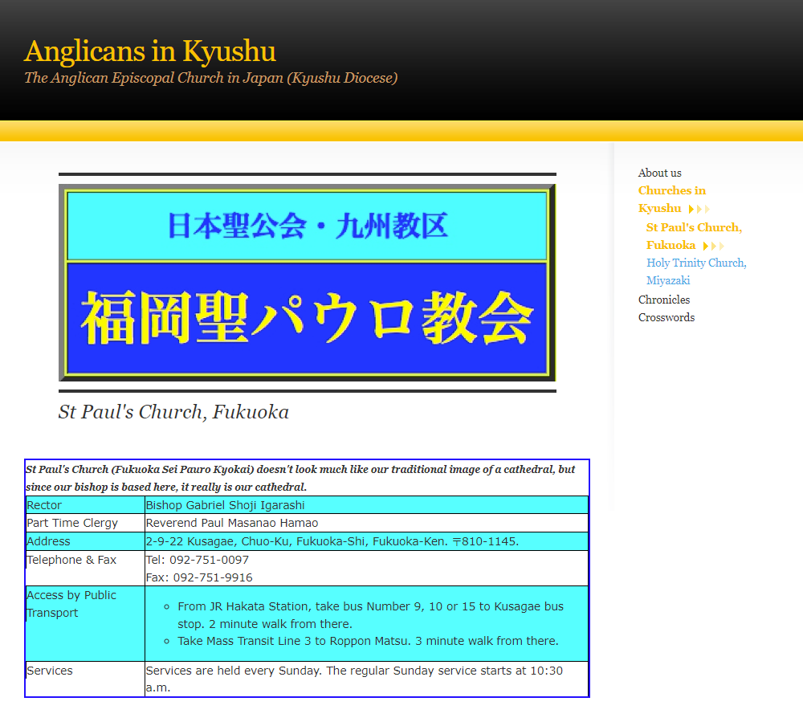

# 2023年4月16日 - 福岡聖保羅堂 + Boss E．ZO + Mark Is

## 福岡聖公會聖保羅堂

尋晚諗好咗要幫個囡出一張儲值卡撘車，點知原來日本要出“小兒”嘅儲值卡係要登記住址同當地電話嘅。
咁無計啦，唯有比現金買地鐵飛啦。

如果旅行會過星期日，我哋一般都會搵教會做崇拜。
福岡聖公會聖保羅堂唔係第一次去，4年前聖誕後嘅旅行亦都嚟過。
由我哋住嘅博多撘地鐵去六本松，再行十幾分鐘就到喇。
主日崇拜 10點半開始。佢哋暫時得日文嘅崇拜。

牧師話齋：聖公會崇拜，邊度嘅禮儀都係差唔多嘅。
當日做早禱崇拜，程序基本一樣。唱就當然係唱日文，但係都有我哋熟識嘅詩歌。
除咗因為聽唔明講道而要自己讀經默想之外，大部分嘅程序都係跟得到嘅。

唯一同香港唔同嘅地方，可能係奉獻。
唔記得大阪同東京嘅聖公會係唔係都一樣，喺崇拜之前就已經收好大家嘅奉獻。
因為我哋遲咗少少，同埋介紹吓自己，於是匆匆忙忙咁樣入咗去崇拜。
下次要記得...

入去嘅時候，同教友傾計嘅時候，知道有一位香港人亦係第一次參加佢哋嘅聚會。
散堂之後，佢哋就好主動咁樣 line up 咗我哋。
雖然佢係第一次參加福岡聖公會聖保羅堂嘅崇拜，但係因為佢喺日本住咗一段時間，所以日文流利。
佢就做咗我哋同日本人教友之間嘅翻譯。佢亦都介紹咗一啲景點比我哋。傾咗一陣，我哋就離開咗喇。

離開之後，我哋就行去[釜かつ](https://www.kamakatu.com/)食咗一餐美味嘅午餐。

## うんこミュージアム + teamLab※Forest

食飽飯，我哋就去坐 10分鐘巴士，由***鳥飼三丁目***去***九州医療センター***，落車就行過去 [FUKUOKA PayPay Dome](https://www.softbankhawks.co.jp/stadium/) 隔離嘅 [Boss E．ZO FUKUOKA](https://e-zofukuoka.com/)。

Boss E．ZO FUKUOKA 有好幾樣嘅玩。其中我哋就揀咗去 [うんこミュージアム](https://unkomuseum.com/) 同 [teamLab※Forest](https://www.teamlab.art/e/forest/)。
好似 Blueline Park 咁，因為唔知道行程時間，所以冇預先訂飛。而佢哋嘅飛都要揀入場時間，雖然唔知會唔會真係過時唔準入，不過日本人嘅嘢，都係唔博，現場買飛好啲。

如果無記錯，曾經有一年去神戶。當時嗰度都有 うんこミュージアム，不過嗰時個囡仲細，所以揀咗去 アンパンマンミュージアム。
雖然福岡都有 アンパンマンミュージアム，上次嚟福岡都曾經去過，不過今次囡大喇，想去 うんこミュージアム。
日本人好有心機，入 うんこミュージアム 之後唔係就咁行吓、睇吓、玩吓就算。佢哋會先帶你去了解日本 うんこ 嘅文化，同打氣一吓熱吓身。
打完氣仲未完。之後會帶你去一排座厠，每人喺座厠“唔”一吓，送你一份記念品，可以打卡嗰陣用，十分有心思。
之後就正式入去展覽嘅地方，裏面有得打卡，同埋有好多小遊戲可以玩。雖然地方細細，而且人都唔少，但係唔覺唔覺都可以逗留好耐。

